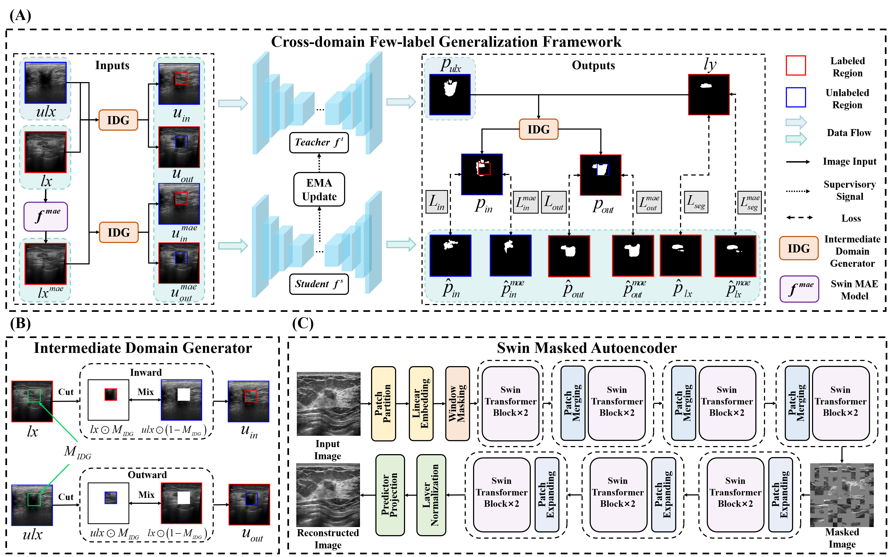
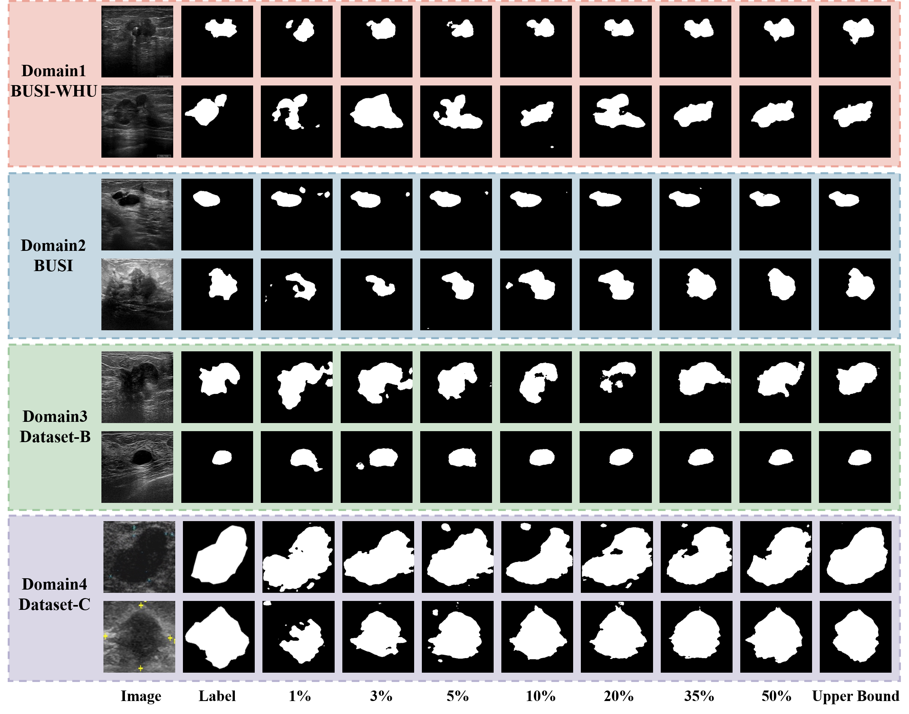
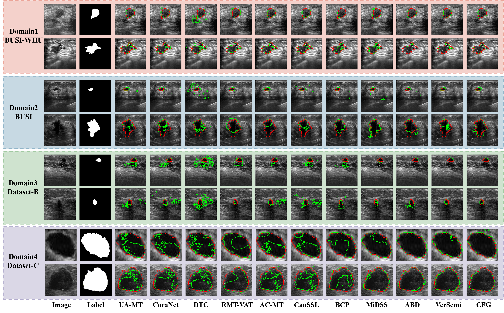

# Rethinking Multi-center Semi-supervised Breast Cancer Ultrasound Image Segmentation: An Intermediate-domain Perspective

## Overview

<p align='center'>
    
</p>

Fig. 1. (A) Overview of the CFG framework. IDG bidirectionally combines labeled and unlabeled samples to generate intermediate domain samples. Best viewed in color. (B) Overview of the IDG. Cut denotes dividing the sample into foreground and background based on M<sub>IDG</sub>, while Mix involves merging the two parts into an intermediate sample. (C) Overview of the Swin MAE.

## Experimental Results

<p align='center'>
    
</p>
Fig. 3. Visual segmentation results of CFG framework using different labeled ratio samples from the BUSI-WHU domain.

<p align='center'>
    
</p>
Fig. 4. Visual comparison results from four domains. $\textcolor{green}{Green}$ represents the segmentation results and $\textcolor{red}{red}$ represents the labels.

## Requirements

This repository is based on PyTorch 2.4.0, CUDA 12.6 and Python 3.10.9.

## Dataset Construction

The dataset needs to be divided into three folders for training, validating, and testing. The training data should be in the format of the "data/BreastSlice/1-WHU/train/image" folder.

## Train
To pre-train the Swin MAE model

```python
python code/networks/Swin_MAE/train.py --batch_size ... --epoch ... --mask_ratio ...
```

Then, train on the CFG framework 
```python
python code/train.py --domain_num ... --lb_domain ...
```

## Test  

```
python test.py --dataset
```

## Visualization

```
python code/visualization.py
```
